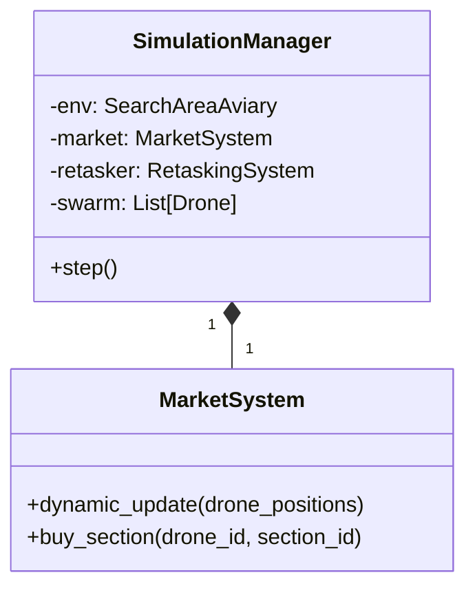

# 1. Methodology

## 1.1 Introduction
The deployment of Multi-UAV (Unmanned Aerial Vehicle) systems for search and rescue (SAR) missions requires robust coordination strategies that can adapt to dynamic environments and agent failures. Traditional centralized control systems often suffer from single points of failure and communication bottlenecks. To address these challenges, this project implements a decentralized, market-based consensus approach for task allocation and target verification in a drone swarm.

The proposed solution utilizes a virtual economy where drones "bid" for search tasks (sections of the environment) based on their current state (position, battery level) and potential reward. This mechanism ensures efficient coverage while naturally handling dynamic constraints such as battery depletion or sensor failures.

*Note: While the conceptual model is decentralized (each agent calculates its own utility), the current simulation implementation utilizes a central `MarketSystem` module to manage bids and transactions for efficiency and analysis.*

## 1.2 Mathematical Model

### 1.2.1 System Definitions
Let the search area $\mathcal{A} \subset \mathbb{R}^2$ be discretized into a set of $M$ non-overlapping rectangular sections $\mathcal{S} = \{s_1, s_2, \dots, s_M\}$.
Let the swarm consist of $N$ autonomous drones $\mathcal{D} = \{d_1, d_2, \dots, d_N\}$.

The state of each drone $d_i$ at time $t$ is defined as $\mathbf{x}_i(t) = [p_i(t), b_i(t), h_i(t)]^T$, where:
-   $p_i(t) \in \mathbb{R}^3$: Position capability vector.
-   $b_i(t) \in [0, 100]$: Battery level.
-   $h_i(t) \in \mathcal{H}$: Health status from the set of possible fault states (e.g., OK, SENSOR_FAIL, LOW_BATTERY).

### 1.2.2 Market Dynamics

#### Pricing Function
The cost $C_{ij}(t)$ for drone $d_i$ to acquire a target section $s_j$ is dynamically determined to balance the intrinsic value of the task against the travel cost. We define the pricing function as:

$$
C_{ij}(t) = V_{base} \cdot \left( 1 + \frac{\| p_i(t) - p_{s_j} \|}{\delta} \right)
$$

Where:
-   $V_{base}$ is the base utility value of searching a section (default: $2.0$).
-   $p_{s_j}$ is the centroid position of section $s_j$.
-   $\| \cdot \|$ denotes the Euclidean distance.
-   $\delta$ is a distance scaling factor (set to $10.0$ in our experiments).

This function ensures that:
1.  **Locality**: Drones prefer closer sections to minimize energy expenditure.
2.  **Coverage**: Even distant sections have a finite price, ensuring they are eventually cleared if no closer options exist.

#### Auction and Allocation Mechanism
The allocation strategy employs a **Global Greedy Auction** to minimize the system-wide participation cost while adhering to agent budget constraints.

**Bidding Process**: At each decision epoch $t$, every available drone $d_i$ generates a bid $B_{ij}$ for every available section $s_j$:
$$ B_{ij} = C_{ij}(t) $$

**Allocation Rule**: The market clears transactions by iteratively selecting the triplet $(d_i, s_j, C_{ij})$ that minimizes the cost, subject to the drone's budget capability:
$$ (d^*, s^*) = \arg\min_{(d_i, s_j) \in \mathcal{D} \times \mathcal{S}} C_{ij}(t) $$
Subject to:
$$ W_i(t) \ge C_{ij}(t) $$

**Theoretical Justification and Complexity**:
The assignment problem is traditionally solved to optimality using the Hungarian Algorithm (Kuhn-Munkres) with time complexity $\mathcal{O}(N^3)$, where $N$ is the number of agents. However, in dynamic SAR missions where $N$ and $M$ (tasks) fluctuate due to failures and discoveries, lower latency is prioritized over absolute optimality.
Our **Greedy Approximation** operates with complexity $\mathcal{O}(NM \log(NM))$ (dominated by sorting bids). While this does not guarantee a globally minimal cost, it approximates a **Pareto Efficient** allocation where no agent can improve its utility without increasing the global cost, sufficient for real-time robotic swarms.

#### Wallet Dynamics
The wallet balance $W_i$ of drone $d_i$ evolves according to:
$$ W_i(t_{k+1}) = W_i(t_k) - \text{Cost}_{out} + \text{Reward}_{in} - \text{Penalty} $$

### 1.2.3 Consensus Mechanism
A voting process is initiated when a drone $d_{det}$ detects a signal with confidence $c > c_{thresh}$ within section $s_k$.

**Consensus Rule**: The target is confirmed if and only if the number of positive confirmations (votes) $N_{pos}$ from the $k$ nearest neighbors satisfies:
$$ N_{pos} \ge |\mathcal{V}| $$
Where $\mathcal{V}$ is the set of recruited verifiers.

**Probabilistic Error Analysis**:
Let $P(FP)$ be the probability of a single sensor generating a False Positive (due to noise or environmental artifacts). Assuming independent observations among spatially distributed verifiers, the probability of a false swarm consensus $P(FP_{swarm})$ with strict unanimity is:
$$ P(FP_{swarm}) = P(FP)^{|\mathcal{V}| + 1} $$
For a typical sensor $P(FP) \approx 0.1$ and $|\mathcal{V}|=3$ verifiers (plus the detector), the error rate drops to $10^{-4}$, significantly enhancing mission reliability.

### 1.2.4 Motion Planning (Potential Fields)
To navigate the environment safely, each drone employs a decentralized reactive collision avoidance controller based on **Artificial Potential Fields (APF)**.

The total repulsive force $\mathbf{F}_{rep}$ acting on drone $d_i$ is:
$$ \mathbf{F}_{rep} = \sum_{d_j \in \mathcal{N}_i} \mathbf{F}_{drone}(d_i, d_j) + \mathbf{F}_{border}(d_i) $$

## 1.3 Algorithm Implementation

### 1.3.1 Software Architecture
The system follows a modular architecture with a central `SimulationManager` managing the `MarketSystem`, `RetaskingSystem`, and individual `Drone` controllers.

### 1.3.2 Path Generation (Lawnmower)
We implement a geometric coverage algorithm that generates a Boustrophedon path.

**Algorithm**:
1.  Define boundaries of the section centered at $C$.
2.  Generate $K$ scan lines along the Y-axis.
3.  Connect endpoints to form a continuous sweeping path.
This guarantees $100\%$ sensor coverage of the assigned section.
